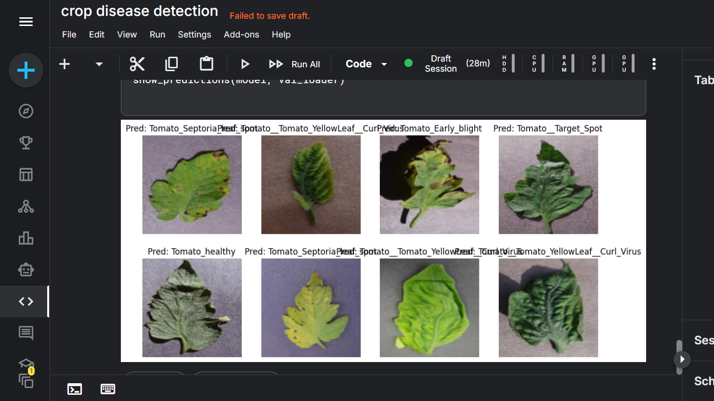
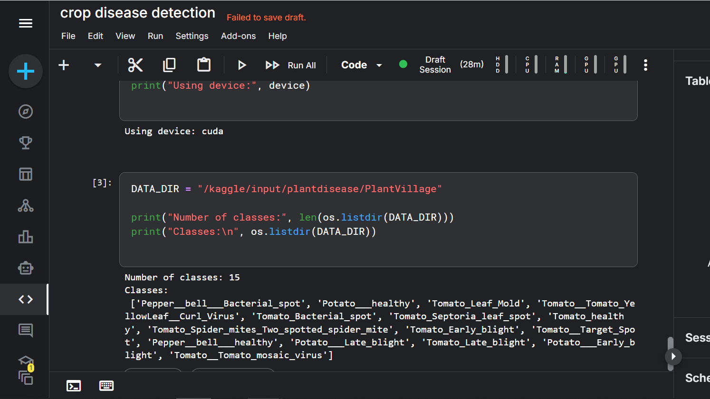

# 🌿 Leaf Disease Classification using CNN

## 📌 Objective

Build a Convolutional Neural Network (CNN) to classify plant leaf diseases using the PlantVillage dataset.

This project demonstrates:

- Image preprocessing
- CNN implementation from scratch
- Multi-class classification
- Model evaluation
- Result visualization

---

## 📊 Dataset

- **Name:** PlantVillage
- **Source:** https://www.kaggle.com/datasets/emmarex/plantdisease
- **Classes:** 15 plant disease categories
- **Type:** RGB leaf images

---

## 🧠 Methodology

- Resize images to 128x128
- Normalize pixel values
- 80/20 train-validation split
- Custom CNN architecture
- CrossEntropyLoss
- Adam optimizer
- GPU training (Kaggle)

---

## 🏗 Model Architecture

Conv → ReLU → MaxPool (x3)  
Fully Connected Layer  
Softmax Output (15 classes)

---

## 📈 Results

### 🔹 Sample Predictions

---

### 🔹 Data files

---

### 🔹 Training Loop

---

## 🎯 Performance

- Validation Accuracy: ~90% (5 epochs)
- Stable convergence
- Strong class separation

---

## 🧪 Skills Demonstrated

- PyTorch model development
- Computer vision preprocessing
- CNN design
- Model evaluation
- Experimental workflow

---

## 🚀 Future Improvements

- Transfer learning (ResNet18)
- Grad-CAM visualization
- Class-wise F1-score analysis
- Cross-dataset generalization
